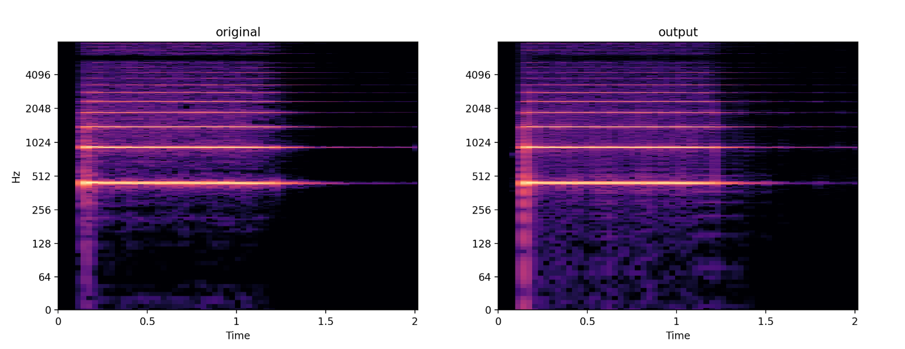
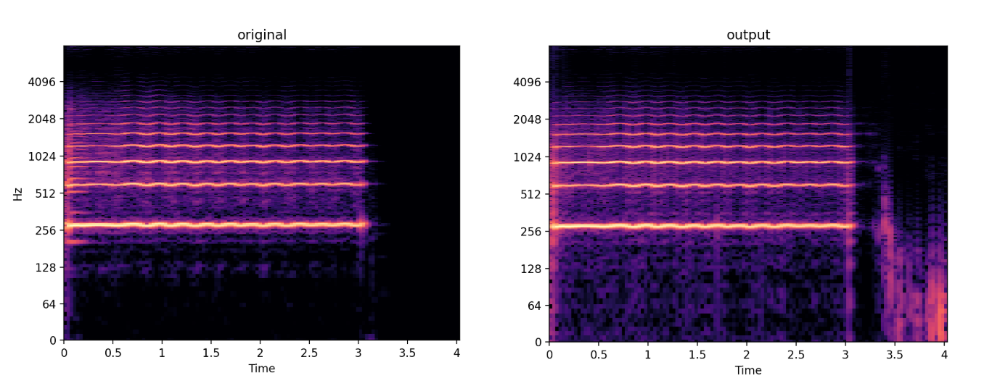

# Differentiable Wavetable Synthesis

Unofficial PyTorch implementation of [Differentiable Wavetable Synthesis](https://arxiv.org/pdf/2111.10003.pdf) by Shan et al.

Pretrained checkpoints to be added.

## Dataset

Download the [full NSynth dataset](https://magenta.tensorflow.org/datasets/nsynth) and filter the subset following the [filtering logic stated here](https://www.tensorflow.org/datasets/catalog/nsynth#nsynthgansynth_subset). 

```
// Download the full dataset as instructed. The file structure should look like:

// nsynth
// |-- nsynth-train
//    |-- audio
//        |-- xxxx.wav
//        |-- ...
//    |-- examples.json
// |-- nsynth-valid     // same for validation set
// |-- nsynth-test      // same for test set


// Then run the script below to generate the filtered subsets
python nsynth_subset.py
```

The subsets files `keys_xxx.txt` are already used in my dataloader script.

Alternatively, you can directly head to [this link](https://www.tensorflow.org/datasets/catalog/nsynth#nsynthgansynth_subset) to get the subset, but you might need slight changes on the dataloader.

## Train and Test

Configure `config.yaml` and run `python train.py` should work.

`train_local.py` is added to validate the training and implementation on just one example. 

## Results


Partial results in `test_audio`, to be updated.

Trumpet:



Flute:



## Acknowledgement

Most of the DDSP code is adapted from the [DDSP PyTorch implementation](https://github.com/acids-ircam/ddsp_pytorch) by @acids_ircam.